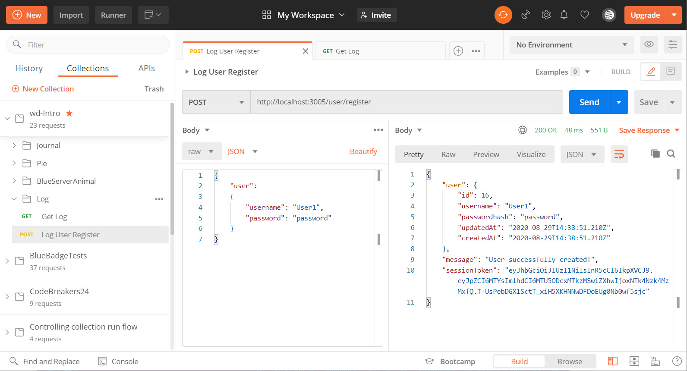
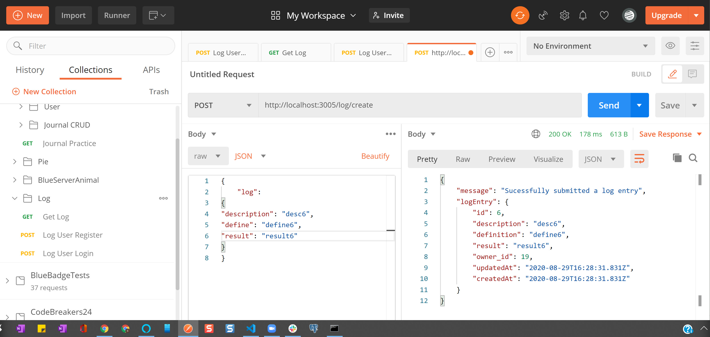
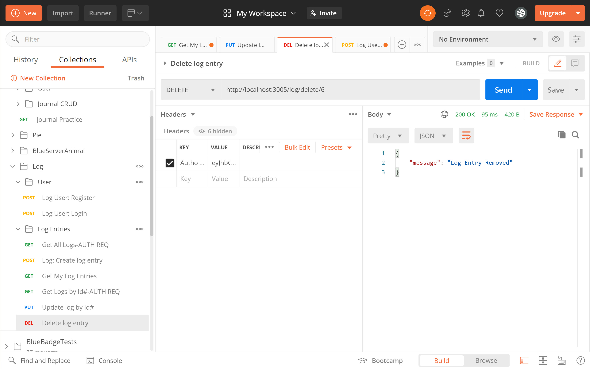

# WD-workoutLog

### Please see below for images of endpoint & tokens, etc.

**Endpoints:**
Endpoint | Verb | Description
-------- | ---- | -----------

**1.** /user/register |	POST | Allows a new user to be created with a username and password.

**2.** /user/login |POST |Allows log in with an existing user.

**3.** /log/ | POST |	Allows users to create a workout log with descriptions, definitions, results, and owner properties.

**4.** /log/ | GET |	Gets all logs for an individual user.

**5.** /log/:id	| GET |	Gets individual logs by id for an individual user.

**6.** /log/:id |	PUT |	Allows individual logs to be updated by a user.

**7.** /log/:id |	DELETE |	Allows individual logs to be deleted by a user.

