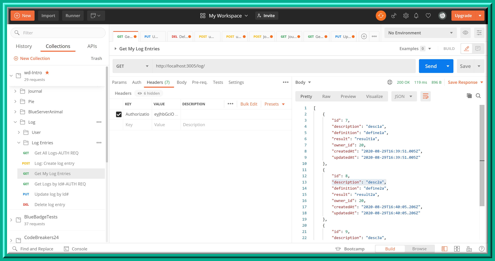

# WD-workoutLog

## Please see below for images of endpoint & tokens, etc.

### Endpoints:
Endpoint | Verb | Description
-------- | ---- | -----------

#### 1. /user/register |	POST | Allows a new user to be created with a username and password.

#### 2. /user/login | POST |Allows log in with an existing user.

#### 3. /log/ | POST |	Allows users to create a workout log with descriptions, definitions, results, and owner properties.

#### 4. /log/ | GET |	Gets all logs for an individual user.

#### 5. /log/:id	| GET |	Gets individual logs by id for an individual user.

#### 6. /log/:id |	PUT |	Allows individual logs to be updated by a user.

#### 7. /log/:id |	DELETE |	Allows individual logs to be deleted by a user.

